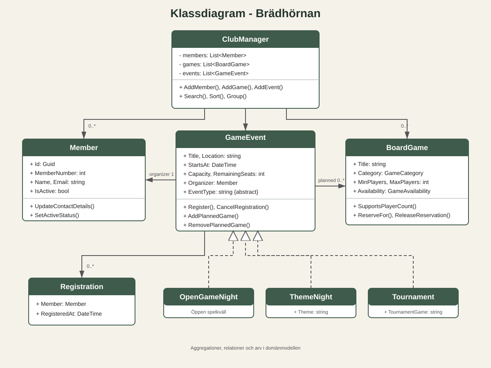
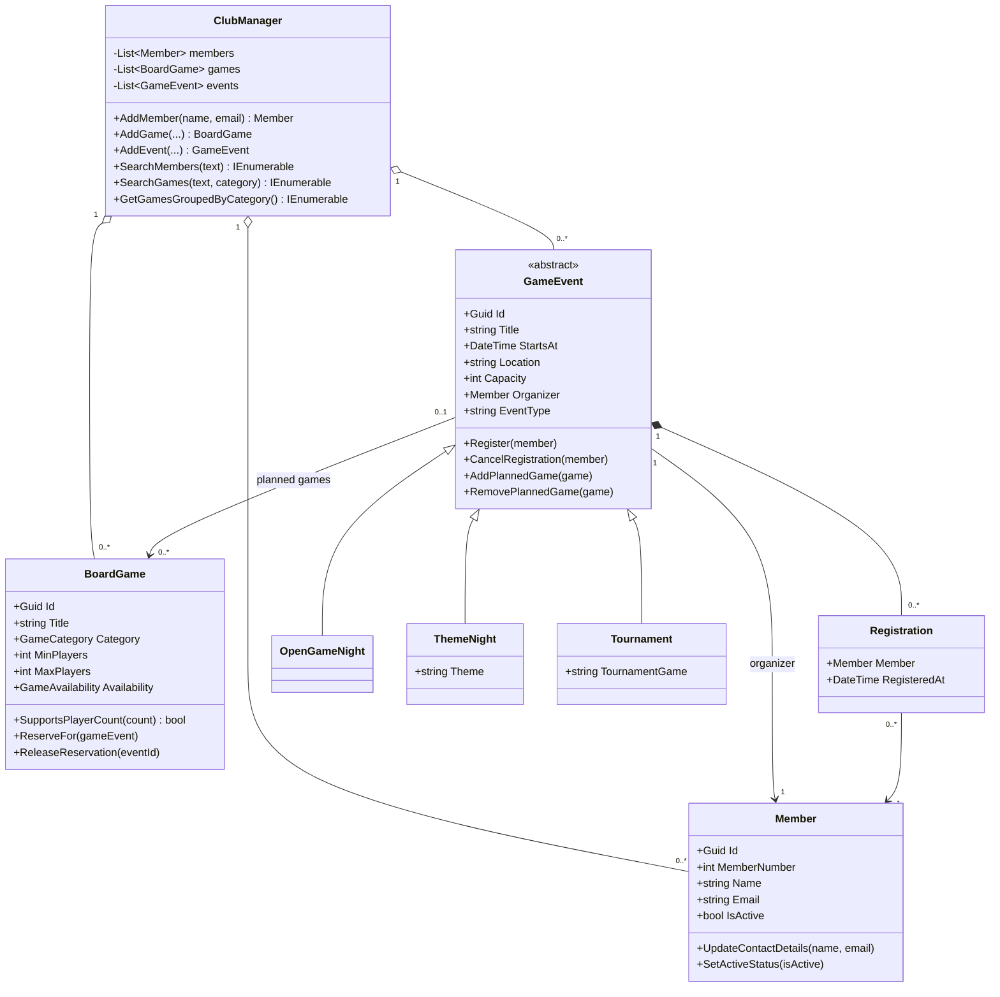

# Klassdiagram

Diagrammet visar de viktigaste domänklasserna. WPF-klasserna är inte med eftersom diagrammet ska
fokusera på verksamhetens modell.

```mermaid
classDiagram
    class ClubManager {
        -List~Member~ members
        -List~BoardGame~ games
        -List~GameEvent~ events
        +AddMember(name, email) Member
        +AddGame(...) BoardGame
        +AddEvent(...) GameEvent
        +SearchMembers(text) IEnumerable
        +SearchGames(text, category) IEnumerable
        +GetGamesGroupedByCategory() IEnumerable
    }

    class Member {
        +Guid Id
        +int MemberNumber
        +string Name
        +string Email
        +bool IsActive
        +UpdateContactDetails(name, email)
        +SetActiveStatus(isActive)
    }

    class BoardGame {
        +Guid Id
        +string Title
        +GameCategory Category
        +int MinPlayers
        +int MaxPlayers
        +GameAvailability Availability
        +SupportsPlayerCount(count) bool
        +ReserveFor(gameEvent)
        +ReleaseReservation(eventId)
    }

    class GameEvent {
        <<abstract>>
        +Guid Id
        +string Title
        +DateTime StartsAt
        +string Location
        +int Capacity
        +Member Organizer
        +string EventType
        +Register(member)
        +CancelRegistration(member)
        +AddPlannedGame(game)
        +RemovePlannedGame(game)
    }

    class Registration {
        +Member Member
        +DateTime RegisteredAt
    }

    class OpenGameNight
    class ThemeNight {
        +string Theme
    }
    class Tournament {
        +string TournamentGame
    }

    ClubManager "1" o-- "0..*" Member
    ClubManager "1" o-- "0..*" BoardGame
    ClubManager "1" o-- "0..*" GameEvent
    GameEvent "1" --> "1" Member : organizer
    GameEvent "1" *-- "0..*" Registration
    Registration "0..*" --> "1" Member
    GameEvent "0..1" --> "0..*" BoardGame : planned games
    GameEvent <|-- OpenGameNight
    GameEvent <|-- ThemeNight
    GameEvent <|-- Tournament
```
