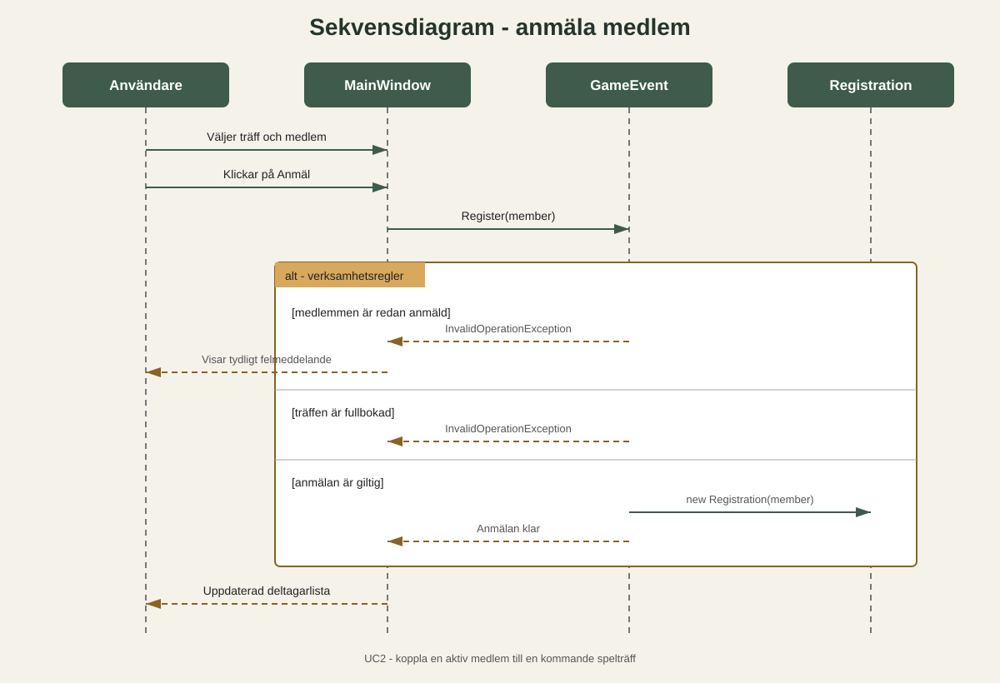
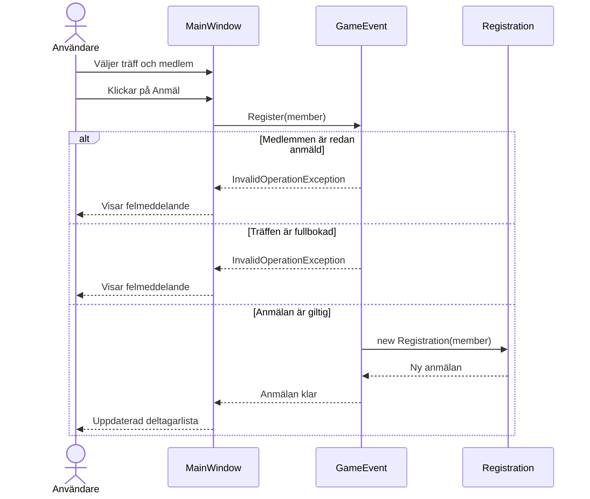

# Sekvensdiagram - anmäla medlem till spelträff

Diagrammet visar både det vanliga flödet och de två viktigaste reglerna: ingen dubbelanmälan och
ingen anmälan när träffen är full.

```mermaid
sequenceDiagram
    actor User as Användare
    participant UI as MainWindow
    participant Event as GameEvent
    participant Reg as Registration

    User->>UI: Väljer träff och medlem
    User->>UI: Klickar på Anmäl
    UI->>Event: Register(member)

    alt Medlemmen är redan anmäld
        Event-->>UI: InvalidOperationException
        UI-->>User: Visar felmeddelande
    else Träffen är fullbokad
        Event-->>UI: InvalidOperationException
        UI-->>User: Visar felmeddelande
    else Anmälan är giltig
        Event->>Reg: new Registration(member)
        Reg-->>Event: Ny anmälan
        Event-->>UI: Anmälan klar
        UI-->>User: Uppdaterad deltagarlista
    end
```
